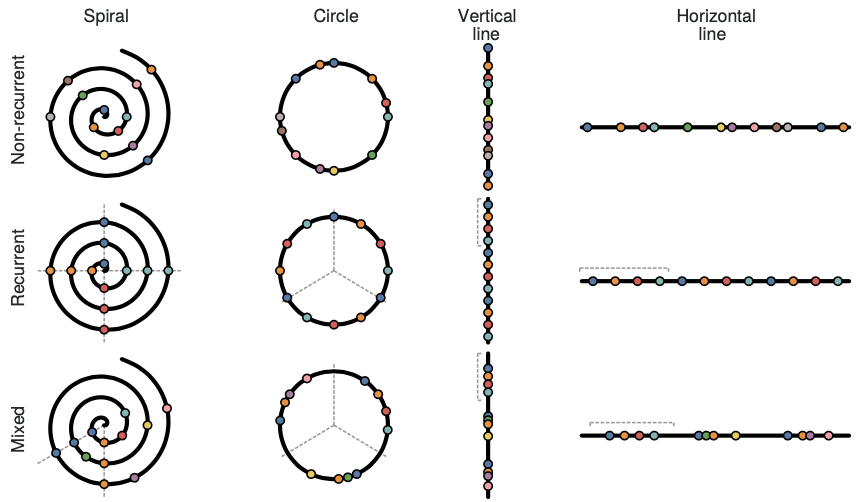
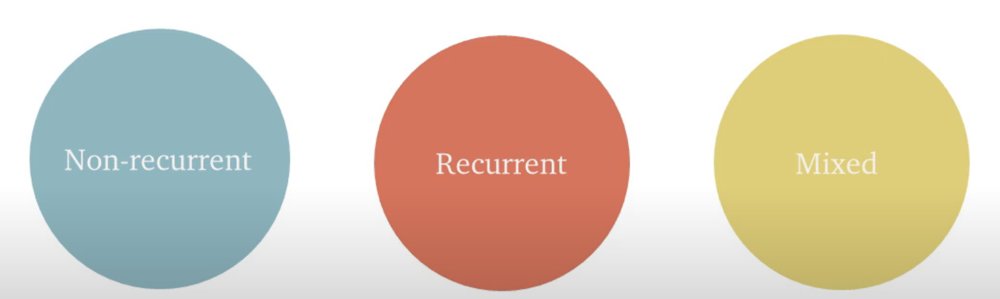

```{r setup, include=FALSE}
knitr::opts_chunk$set(echo = FALSE)
```

## ABSTRACT




We evaluate the effect on task performance of 4 timeline shapes (left to right) across 3 types of temporal event sequence data (top to bottom).
timelines come in many shapes and forms leaving us to ask what the timelines work 

## Temporal data can have different characteristics




## Slide with R Output

```{r cars, echo = TRUE}
summary(cars)
```

## Slide with Plot

```{r pressure}
plot(pressure)
```

